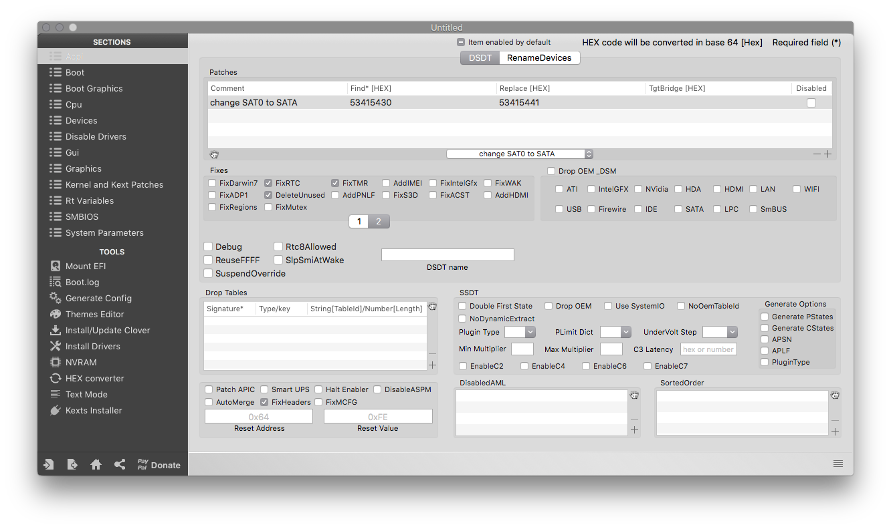
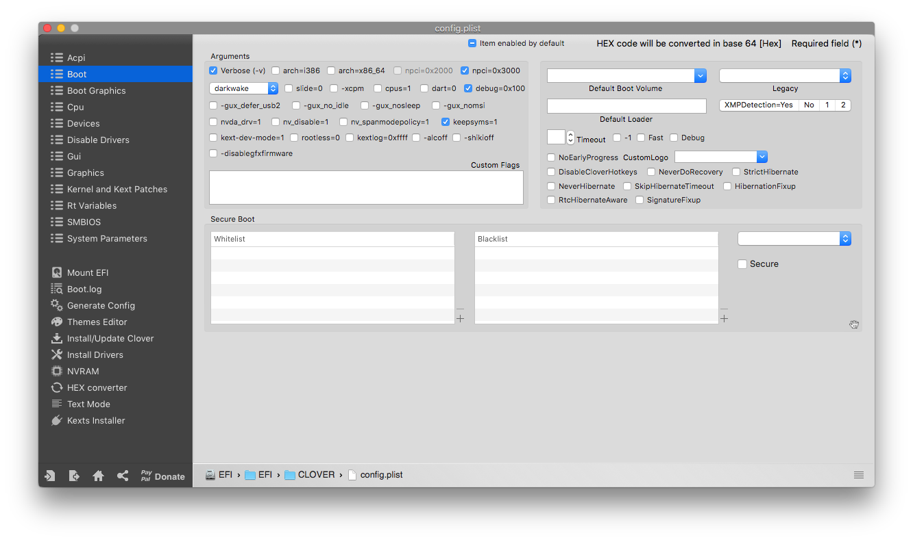
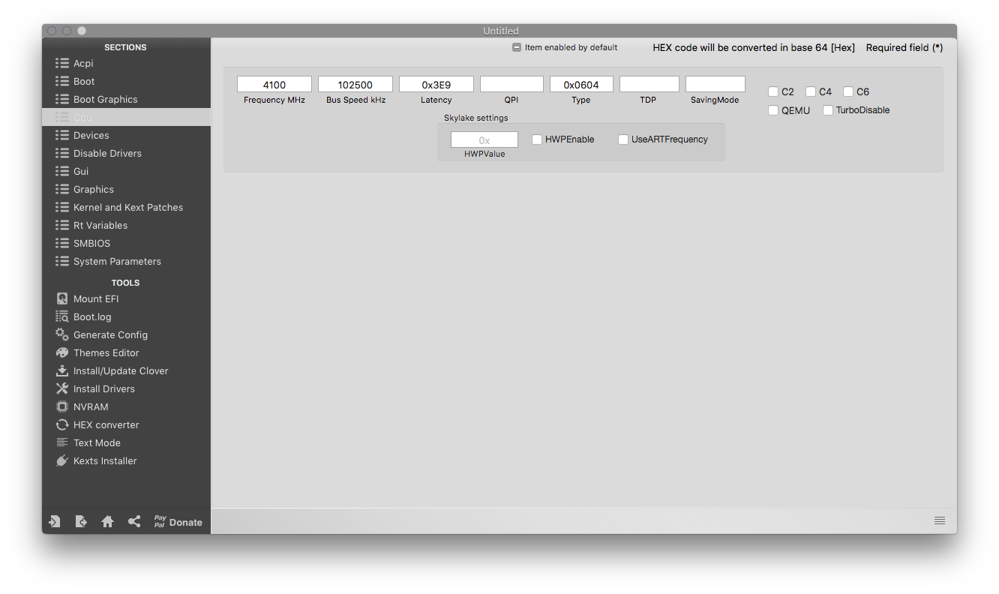
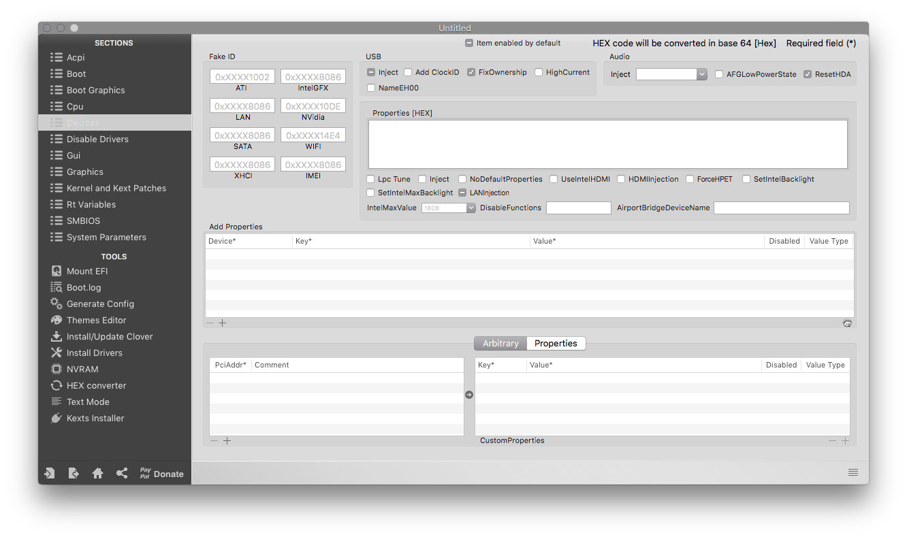
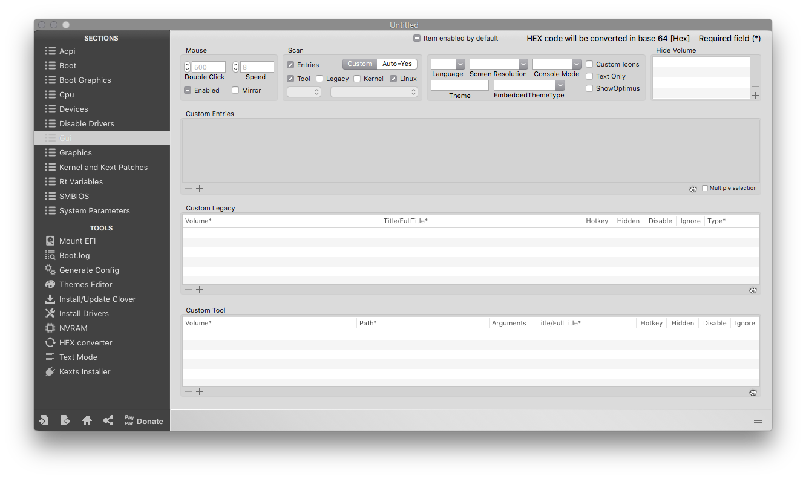
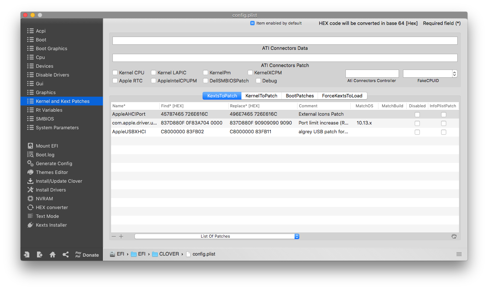
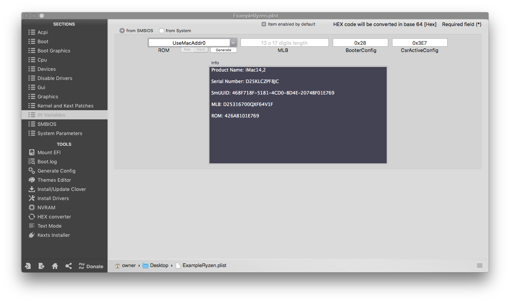
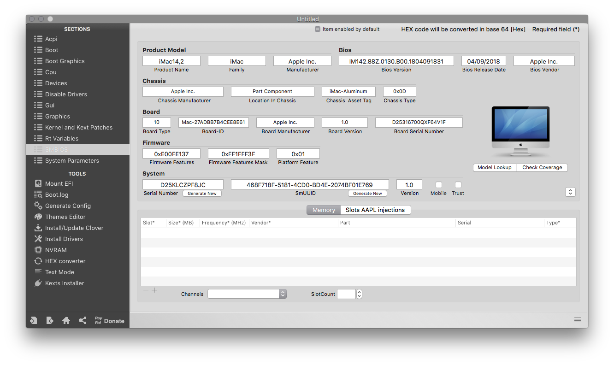
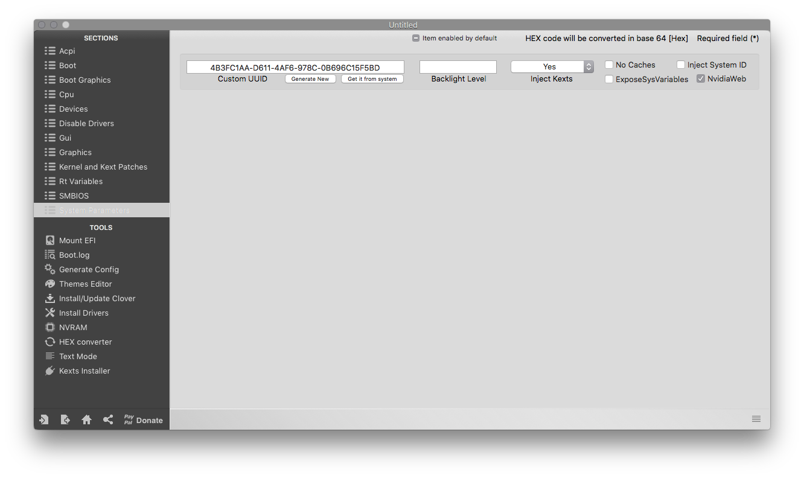

# Ryzen

## Starting point

I personally prefer to start with an empty config.plist when setting up a desktop, as it means I don't have to worry whether I unticked the correct options. Plus it allows to just have a cleaner config.

You can get a blank config by pressing _command + n_ inside Clover configurator. I will also be sharing the XML of each section for those who prefer working with a text editor.

## ACPI

### XML

```markup
<key>ACPI</key>
	<dict>
		<key>DSDT</key>
		<dict>
			<key>Fixes</key>
			<dict>
				<key>DeleteUnused</key>
				<true/>
				<key>FixHPET</key>
				<true/>
				<key>FixIPIC</key>
				<true/>
				<key>FixRTC</key>
				<true/>
				<key>FixShutdown</key>
				<true/>
				<key>FixTMR</key>
				<true/>
			</dict>
			<key>Patches</key>
			<array>
				<dict>
					<key>Comment</key>
					<string>change SAT0 to SATA</string>
					<key>Disabled</key>
					<false/>
					<key>Find</key>
					<data>
					U0FUMA==
					</data>
					<key>Replace</key>
					<data>
					U0FUQQ==
					</data>
				</dict>
			</array>
		</dict>
		<key>FixHeaders</key>
		<true/>
	</dict>
```

### Clover Configurator screenshots





### Explanation <a id="explanation"></a>

#### Patches: <a id="patches"></a>

The first thing we'll go over is the _Patches_ section. This section allows us to dynamically rename parts of the DSDT via Clover. Since we're not running a real mac, and macOS is pretty particular with how things are named, we can make non-destructive changes to keep things mac-friendly. We have three entries here:

* _change SAT0 to SATA_ - for potential SATA compatibility

#### Fixes: <a id="fixes"></a>

If we look then at the _Fixes_ section, we'll see that we have a few things checked \(there are 2 pages, so I included 2 screenshots\):

* _FixShutdown_ - this can help with some boards that prefer to restart instead of shutdown. Sometimes it can cause shutdown issues on other boards \(ironic, right?\), so if you have issues shutting down with this enabled, look at disabling it.
* The remaining fixes help avoid IRQ conflicts and etc, and are not known to cause issues. They may not be necessary for all hardware, but do not negatively impact anything if applied.

#### FixHeaders: <a id="fixheaders-and-plugintype"></a>

The only other things we've done on this page are enable that checkbox.

* _FixHeaders_ - This checkbox tells Clover to sanitize headers to avoid kernel panics related to unprintable characters.

## Boot

### XML

```markup
<key>Boot</key>
	<dict>
		<key>Arguments</key>
		<string>-v keepsyms=1 npci=0x3000 debug=0x100</string>
		<key>DefaultVolume</key>
		<string>LastBootedVolume</string>
		<key>Timeout</key>
		<integer>5</integer>
	</dict>
```

### Clover Configurator screenshots



###  Explanation

#### Arguments: <a id="arguments"></a>

We have a few boot args set here:

* `-v` - this enables verbose mode, which shows all the _behind-the-scenes_ text that scrolls by as you're booting instead of the Apple logo and progress bar. It's invaluable to any Hackintosher, as it gives you an inside look at the boot process, and can help you identify issues, problem kexts, etc.
* `debug=0x100` - this prevents a reboot on a kernel panic. That way you can \(hopefully\) glean some useful info and follow the breadcrumbs to get past the issues.
* `keepsyms=1` - this is a companion setting to `debug=0x100` that tells the OS to also print the symbols on a kernel panic. That can give some more helpful insight as to what's causing the panic itself.
* `ncpi=0x3000` - this fixes issues with PCI configuration. Without it the machine will often hang on boot.

#### DefaultBootVolume and Timeout: <a id="defaultbootvolume-and-timeout"></a>

These are the only other settings I've updated in this section.

* _DefaultBootVolume_ - this uses NVRAM to remember which volume was last booted by Clover, and auto-select that at the next boot.
* _Timeout_ - this is the number of seconds before the _DefaultBootVolume_ auto-boots. You can set this to `-1` to avoid all timeout, or to `0` to skip the GUI entirely. If set to `0`, you can press any keys at boot to get the GUI to show back up in case of issues.

## Boot graphics

We don't need to change anything here. You can come here if you want to change the scaling of the Clover UI.

## CPU

### XML

```markup
<key>CPU</key>
	<dict>
		<key>BusSpeedkHz</key>
		<integer>102500</integer>
		<key>FrequencyMHz</key>
		<integer>4100</integer>
		<key>Latency</key>
		<string>0x3E9</string>
		<key>Type</key>
		<string>0x0604</string>
	</dict>
```

### Clover Configurator screenshots



### Explanation

We've changed a few settings here, nothing required, but supposedly can help when some experience issues with audio and video being out of sync.

* _Frequency MHz -_ This is the frequency of your CPU in MHz. In my case the CPU runs at 4.1GHz so I entered 4100MHz.
* _Bus Speed kHz -_ This is not actually the FSB of your CPU but it is a little higher to make sure everything stays in sync. Stick with the given value.
* _Latency -_ " This parameter value represents the C3 entry latency issued when entering C3 state." or in layman's terms: Disabling speedstep, since AMD CPUs don't support that.
* _Type -_ Determines what CPU name is displayed in _About this mac_

## Devices

### XML

```markup
<key>Devices</key>
	<dict>
		<key>Audio</key>
		<dict>
			<key>ResetHDA</key>
			<true/>
		</dict>
		<key>USB</key>
		<dict>
			<key>FixOwnership</key>
			<true/>
		</dict>
	</dict>
```

### Clover Configurator screenshots



### Explanation

#### USB:

Under this section, we ensure that _Inject_ and _FixOwnership_ are selected to avoid issues with hanging at a half-printed line somewhere around the `Enabling Legacy Matching` verbose line. You can also get past that by enabling _XHCI Hand Off_ in BIOS.

#### Audio: <a id="audio"></a>

We enabled _ResetHDA_ which puts the codec back in a neutral state between OS reboots. This prevents some issues with no audio after booting to another OS and then back.

## Gui

###  XML <a id="raw-xml-3"></a>

```markup
<key>GUI</key>
	<dict>
		<key>Scan</key>
		<dict>
			<key>Entries</key>
			<true/>
			<key>Linux</key>
			<true/>
			<key>Tool</key>
			<true/>
		</dict>
	</dict>
```

### Clover Configurator screenshots <a id="clover-configurator-screenshots-3"></a>



### Explanation <a id="explanation-3"></a>

#### Scan: <a id="scan"></a>

The only settings I've tweaked on this page are the _Scan_ settings. I've selected _Custom_, then checked everything except _Legacy_ and _Kernel_. This just omits some of the unbootable entries in Clover to clean up the menu.

## Graphics <a id="graphics"></a>

We don't have to do anything here

#### 

## Kernel And Kext Patches <a id="kernel-and-kext-patches"></a>

### XML <a id="raw-xml-5"></a>

```markup
<key>KernelAndKextPatches</key>
	<dict>
		<key>AppleRTC</key>
		<false/>
		<key>KernelLapic</key>
		<false/>
		<key>KernelPm</key>
		<false/>
		<key>KextsToPatch</key>
		<array>
			<dict>
				<key>Comment</key>
				<string>External Icons Patch</string>
				<key>Disabled</key>
				<false/>
				<key>Find</key>
				<data>
				RXh0ZXJuYWw=
				</data>
				<key>InfoPlistPatch</key>
				<false/>
				<key>Name</key>
				<string>AppleAHCIPort</string>
				<key>Replace</key>
				<data>
				SW50ZXJuYWw=
				</data>
			</dict>
			<dict>
				<key>Comment</key>
				<string>Port limit increase (Rehabman)</string>
				<key>Disabled</key>
				<false/>
				<key>Find</key>
				<data>
				g32IDw+DpwQAAA==
				</data>
				<key>InfoPlistPatch</key>
				<false/>
				<key>MatchOS</key>
				<string>10.13.x</string>
				<key>Name</key>
				<string>com.apple.driver.usb.AppleUSBXHCI</string>
				<key>Replace</key>
				<data>
				g32ID5CQkJCQkA==
				</data>
			</dict>
		</array>
	</dict>
```

### Clover Configurator Screenshots <a id="clover-configurator-screenshots-4"></a>



### Explanation <a id="explanation-4"></a>

In this section, we've enabled a few settings and added some kext patches.

#### KextsToPatch: <a id="kextstopatch"></a>

We added 4 different kexts to patch here. Three of them are for USB port limit increases, and the last acts as an _orange icons fix_ - when internal drives are hotpluggable, and treated as external drives.

You'll notice that there are MatchOS values set for each of the USB port limit patches. You can remove any of the entries for OS versions you don't intend to run. They won't do any harm being there, but if you want a clean, minimal plist, there's no sense in having them.

#### FakeCPUID

This setting tells the OS what CPU we have, even if that isn't really what we have. In this case we are telling it our Ryzen is a Skylake U chip.

## Rt Variables <a id="rtvariables-and-smbios"></a>

### XML <a id="raw-xml-6"></a>

```markup
<key>RtVariables</key>
	<dict>
		<key>BooterConfig</key>
		<string>0x28</string>
		<key>CsrActiveConfig</key>
		<string>0x3E7</string>
		<key>ROM</key>
		<data>
		O5ycAedp
		</data>
	</dict>
```

### Clover Configurator screenshots <a id="clover-configurator-screenshots-5"></a>



### Explanation <a id="explanation-5"></a>

_BooterConfig_ gets set to `0x28`, and _CsrActiveConfig_ is set to `0x3e7` which effectively disables SIP. You can choose a number of other options to enable/disable sections of SIP. Some common ones are as follows:

* `0x0` - SIP completely enabled
* `0x3` - Allow unsigned kexts and writing to protected fs locations
* `0x3e7` - SIP completely disabled

**For AMD we need SIP to be disabled**

\*\*\*\*

## SMBIOS

### **XML**

```markup
<key>SMBIOS</key>
	<dict>
		<key>BiosReleaseDate</key>
		<string>04/09/2018</string>
		<key>BiosVendor</key>
		<string>Apple Inc.</string>
		<key>BiosVersion</key>
		<string>IM142.88Z.0130.B00.1804091831</string>
		<key>Board-ID</key>
		<string>Mac-27ADxxxxxxEE8E61</string>
		<key>BoardManufacturer</key>
		<string>Apple Inc.</string>
		<key>BoardSerialNumber</key>
		<string>D25316xxxxxxxxV1F</string>
		<key>BoardType</key>
		<integer>10</integer>
		<key>BoardVersion</key>
		<string>1.0</string>
		<key>ChassisAssetTag</key>
		<string>iMac-Aluminum</string>
		<key>ChassisManufacturer</key>
		<string>Apple Inc.</string>
		<key>ChassisType</key>
		<string>0x0D</string>
		<key>Family</key>
		<string>iMac</string>
		<key>FirmwareFeatures</key>
		<string>0xE00FE137</string>
		<key>FirmwareFeaturesMask</key>
		<string>0xFF1FFF3F</string>
		<key>LocationInChassis</key>
		<string>Part Component</string>
		<key>Manufacturer</key>
		<string>Apple Inc.</string>
		<key>Mobile</key>
		<false/>
		<key>PlatformFeature</key>
		<string>0x01</string>
		<key>ProductName</key>
		<string>iMac14,2</string>
		<key>SerialNumber</key>
		<string>D25KxxxPFxxC</string>
		<key>SmUUID</key>
		<string>468FxxxF-5xx1-4CD0-BD4E-20xxxxxxE769</string>
		<key>Version</key>
		<string>1.0</string>
	</dict>
```

### Clover Configurator screenshots



### Explanation

The SMBIOS is what our machine tells macOS it is. In case of a Ryzen based system you want that to be an iMac14,2. _**Do not copy my values, nor use the default values provided in the example plist.**_ Press on the little square with two arrows on the mid-right of the window.

## System Parameters <a id="system-parameters"></a>

### Raw XML <a id="raw-xml-7"></a>

```markup
<key>SystemParameters</key>
	<dict>
		<key>CustomUUID</key>
		<string>4BxxxxAA-D611-4xx6-978C-0Bxxxxx5F5BD</string>
		<key>InjectKexts</key>
		<string>Yes</string>
		<key>InjectSystemID</key>
		<false/>
		<key>NvidiaWeb</key>
		<true/>
	</dict>
```

### Clover Configurator screenshots <a id="clover-configurator-screenshots-6"></a>



### Explanation <a id="explanation-6"></a>

#### Inject Kexts: <a id="inject-kexts"></a>

This setting has 3 modes:

* `Yes` - this tells Clover to inject kexts from the EFI regardless.
* `No` - this tells Clover not to inject kexts from the EFI.
* `Detect` - this has Clover inject kexts only if _FakeSMC.kext_ is not in the kext cache.

We set it to `Yes` to make sure that all the kexts we added before get injected properly.

#### NvidiaWeb:

In this case I have checked the NvidiaWeb box. This is because I use a modern Nvidia GPU which requires WebDrivers. This option enables the driver to load when it is installed.  


## Example

For those who want it [here is my example Ryzen plist](https://raw.githubusercontent.com/IOIIIO/AMDVanilla/master/files/config.plist). If you plan on using it, I recommend to regenerate the SMBIOS as shown in the above tutorial. This serial has probably been used many times over by now.

